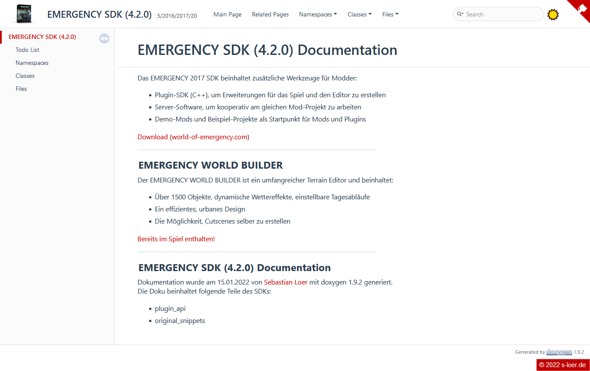

# Emergency SDK (4.2.0) Doc

Doc for [https://github.com/16tons/emergency5_sdk](https://github.com/16tons/emergency5_sdk)

## Disclaimer

This is my approach generating a documentation with [Doxygen](https://www.doxygen.nl/index.html) v1.9.2. The page also uses the [Doxygen Awesome CSS](https://github.com/jothepro/doxygen-awesome-css) from [jothepro @github](https://github.com/jothepro).

The used Doxygen Config/ File can be found [here](DOXYGEN.md)

All sourcecode belongs to [Sixteen Tons Entertainment GmbH](http://www.sixteen-tons.de/). The documentation is based on the current version of the Emergency 5 SKD provided by 16tons at [github](https://github.com/16tons/emergency5_sdk).

## Hostet

The documentation is hostet at [https://sdk.emergency-luedenscheid.de/](https://sdk.emergency-luedenscheid.de/).

